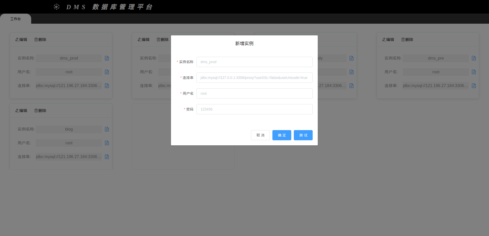
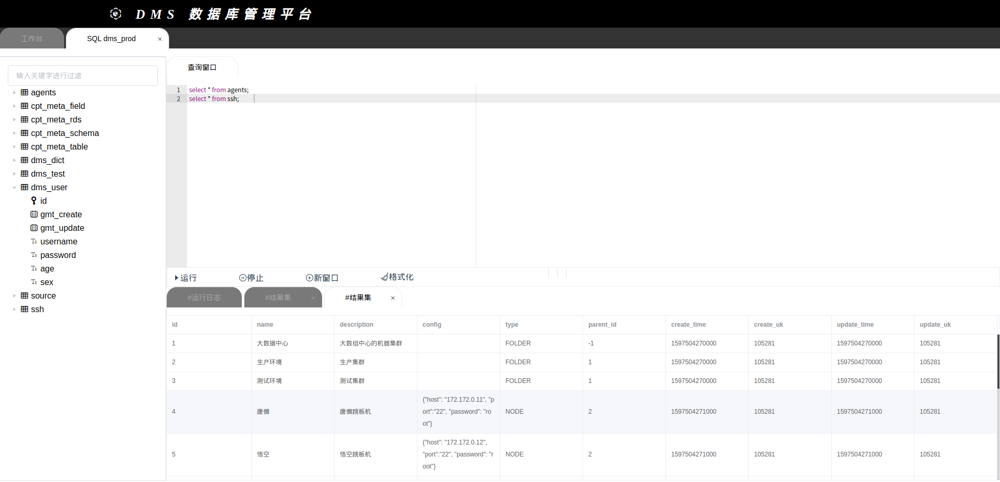
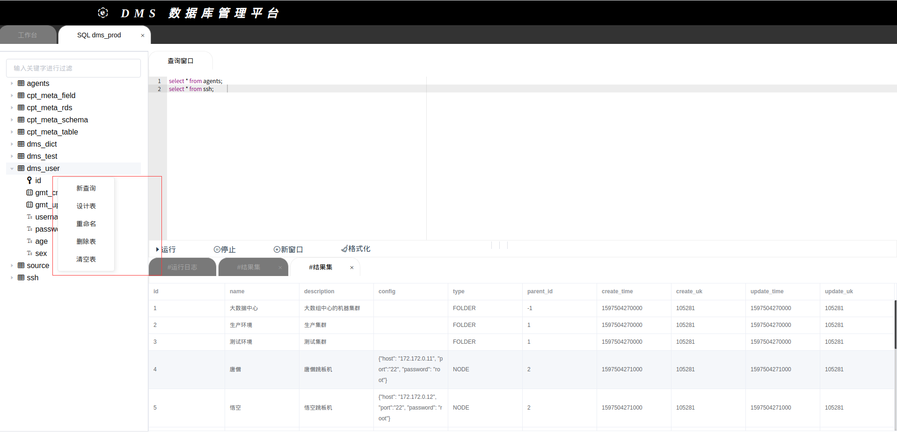
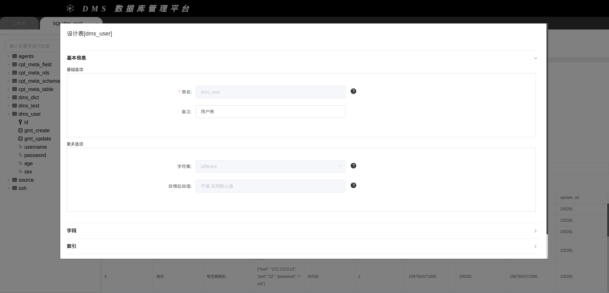
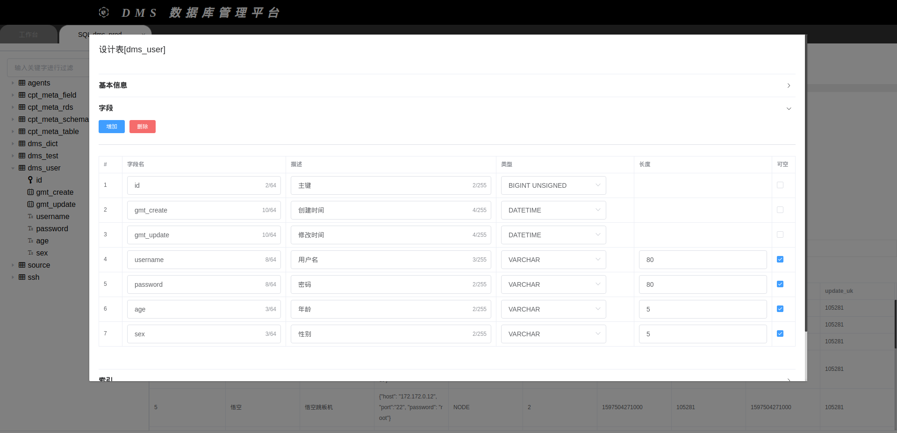
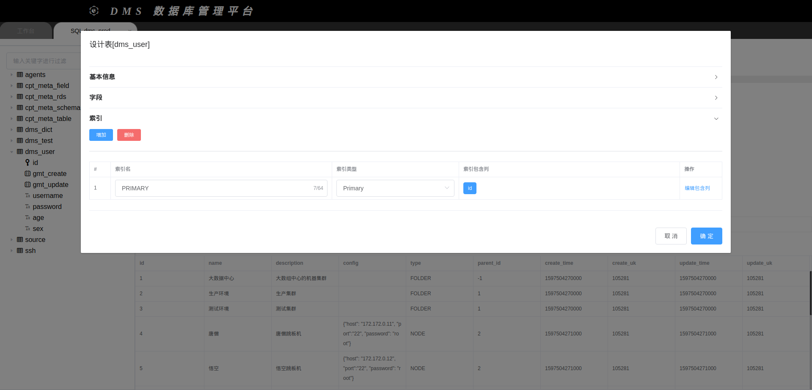
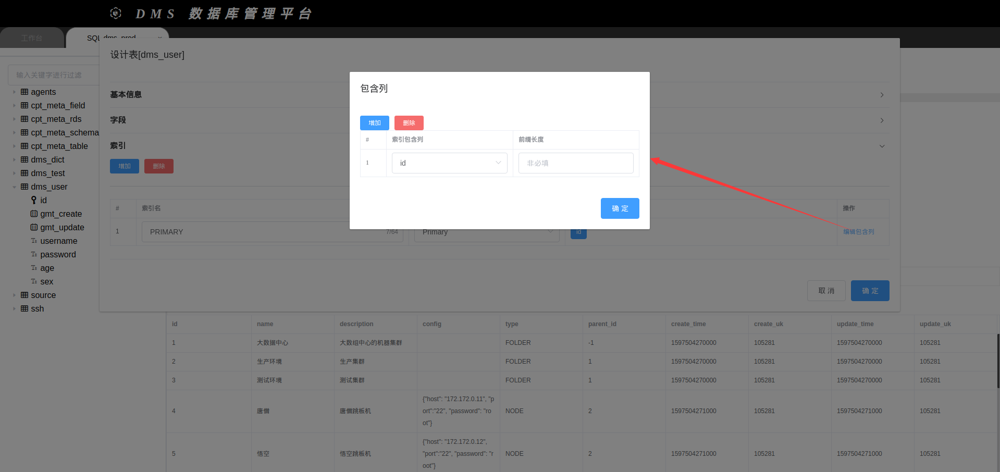

# 数据库管理系统(DMS)
   ### 架构
   ##### 后端
    springboot + mybatis  + h2
   ##### 前端
    vue + element-ui + AceEditor
    
   ##### 功能描述
   
   | 功能 | 状态 | 
   |  ----  | ----  | 
   | 添加数据源 | ✔ | 
   | 修改数据源 | ✔ | 
   | 删除数据源 | ✔ | 
   | 获取指定数据源表信息(表名称, 字符集, 注释, 存储引擎, 自增初始值) | ✔ |
   | 获取指定数据源指定表字段信息(字段名, 注释, 类型, 是否可空, 是否是主键, 默认值, 更新策略, 是否增动增长) | ✔ |
   | 前端sql代码编辑器 | ✔ |
   | sql格式化 | ✔ |
   | 查询结果动态输出 | ✔ |
   | 通过前端页面设计表结构, 索引等信息 | ✔ |
   | 根据结构化数据生成建表语句 | ✔ |
   | 基本交互 | ✔ |   
   | 数据导入 | ｘ |   
   | 数据导出 | ｘ |      
   | 支持Mysql数据源 | ✔ |   
   | 支持presto | ｘ |      
   | 支持oracle | ｘ |     
   | 支持greenPlum | ｘ |     
   | 支持elasticsearch | ｘ |     
            
   ##### 快速运行
    docker run -itd --name dms -e active="dev" -p 8115:8115 -v /root/.m2:/root/.m2 -v /root/.ssh:/root/.ssh zhangyule1993/dms:v1.0.0.release
    
   ### 示例图片
   ##### 首页与数据源管理
   
   
   ##### sql编辑器&查询
   
   
   ##### 右键菜单
   
   
   
   ##### 表设计 - 基本信息
   
   
   ##### 表设计 - 字段信息
   
   
   ##### 表设计 - 索引信息
      
   
      
   #### 本地运行
   ###### 下载代码
    git clone https://github.com/ZhangLe1993/data-manager-service.git
    
   ###### 进入前端目录
    cd data-manager-service
    cd dms-web
   ###### 安装依赖,有些可能需要手动安装 .在 main.js 中有注释.
    cnpm install
    
   ###### 编译打包
    在打包前端资源之前, 先修改 dms-web/src/service/index.js中的 baseUrl, 看 dms-web/src/service/index.js 第二行的注释进行操作
    然后在dms-web目录下执行
    cnpm run build

   ###### 运行springboot
    执行springboot 的 Application方法
    或者直接执行jar包
    cd data-manager-service/out
    java -Dfile.encoding=utf-8 -jar app.jar --spring.profiles.active=dev
   ###### 构建镜像
    cd data-manager-service
    docker build -t 你的镜像地址/名称:版本号 .
    
    